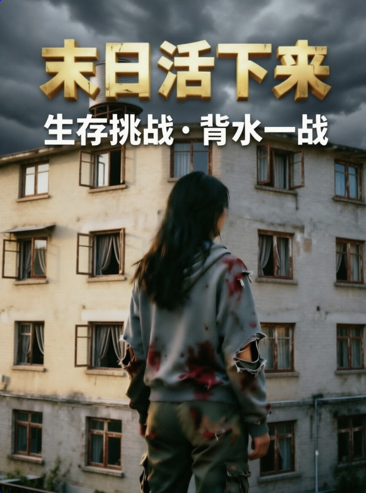
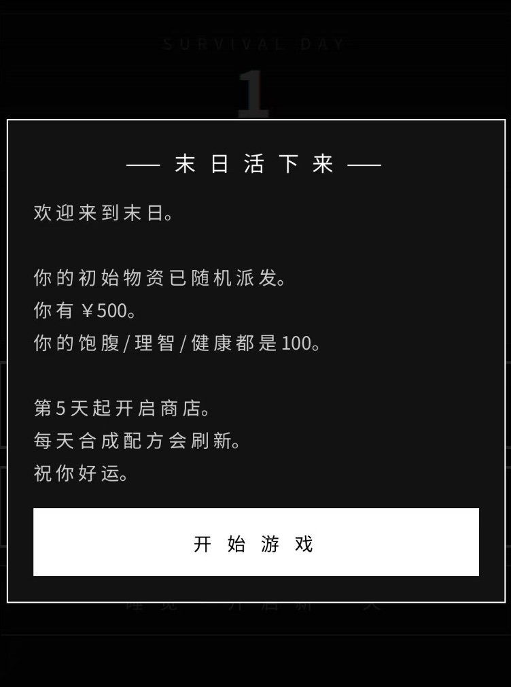
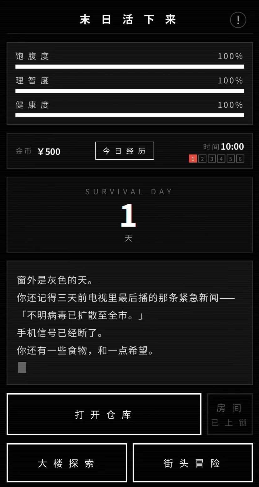

# 末日活下来 ☢️

这是一款末日生存主题的网页小游戏。

## 🎮 游戏简介

末日已至，城市沦为废墟，而你，是最后的幸存者！

躲在家中苟活的每一天，都要做出艰难抉择：
- 🏢 **大楼探索**：每天 4 个房间随机排列，搜刮食物、武器、工具……18:00 之后，那间上锁的房间会发生什么？🚪
- 🌃 **街头冒险**：五金店、银行、医院……每个角落都藏着物资与随机事件——当然，还有危险 👀
- 🧰 **合成配方**：每日刷新的手工配方，把零散物资变成救命道具 🔧
- 🪙 **商店与逃串商人**：第 5 天解锁商店，价格天天浮动；还有神秘的「逃串商人」，用小纸条换惊喜 📜
- ❤️ **状态管理**：饱腹、理智、健康互相牵连，一觉醒来可能天翻地覆 😴
- 🌙 **黑夜小故事**：夜幕降临，总有些故事在等你……

撑过每一天，等待第 30 天的救援。你，能活下来吗？

## 🕹️ 操作方式

纯鼠标点击即可游玩！🖱️
- 点击按钮进行探索、购买、合成等操作
- 在弹窗中选择你的行动
- 进度自动保存（localStorage），关掉浏览器也能接着玩 💾
- 适配手机浏览器，随时随地末日求生 📱

## 🛠️ 技术栈

- HTML5 + CSS3 + JavaScript（原生零依赖）
- 单文件应用，所有代码都在一个 HTML 里
- localStorage 持久化存档

## 🚀 如何运行

1. 下载或克隆本仓库
2. 双击 `doomsday-survival.html`，即可在浏览器中开始游玩！

> 💡 请保留同目录下的 `bgm-home.mp3` 和 `bgm-explore.mp3`，这是背景音乐（来源：Pixabay 免版税曲库）。

## 📸 游戏截图

## 📄 许可证

本项目基于 [MIT License](LICENSE) 开源，随便玩、随便改，觉得不错就点个 star ⭐
